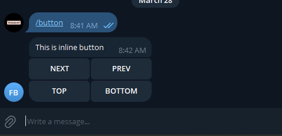
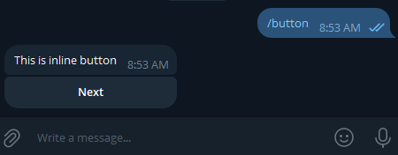
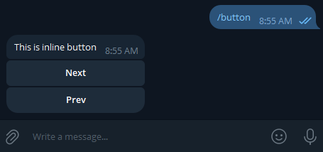
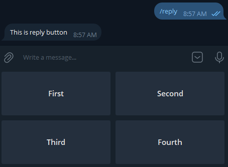
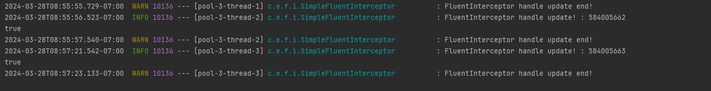

# Fluent - Easy Telegram Bots with Spring!

## Overview

This library provides a high-level abstraction for developing Telegram bots 🤖. The library simplifies the process of
receiving updates from Telegram and sending messages 📨. Additionally, you can easily integrate this library into your
project and customize it according to your preferences by using its latest version when developing your application 🚀.

## Prerequisites

* Fluent 1.2.2 requires at least Java 17, Spring Boot version 3.0.0 or above.

## Getting Started

### Maven

```xml
<dependency>
    <groupId>io.github.nurislom373</groupId>
    <artifactId>spring-boot-starter-fluent</artifactId>
    <version>1.2.2</version>
</dependency>
```

### Gradle

```groovy
implementation group: 'io.github.nurislom373', name: 'spring-boot-starter-fluent', version: '1.2.2'
```

## How to Use

After adding the dependency, set up your bot by adding the bot token and username in your application.yaml file.

```yaml
fluent:
  bot:
    token: <your bot token>
    username: <your bot username>
    process-type: update
```
Once you've added the token and username, create a bot controller.

```java
@UpdateController
public class FluentController {

    private final FluentTemplate fluentTemplate;

    public FluentController(FluentTemplate fluentTemplate) {
        this.fluentTemplate = fluentTemplate;
    }

    @HandleMessage("/start")
    public void fluent(Update update) {
        String text = update.getMessage().getText();
        fluentTemplate.sendText(text);
    }
}
```

Handling exceptions is easy too! Just create an exception controller.

```java
@ExceptionController
public class ExceptionHandler  {

    private final FluentTemplate fluentTemplate;

    public FluentController(FluentTemplate fluentTemplate) {
        this.fluentTemplate = fluentTemplate;
    }
    
    @HandleException({RuntimeException.class})
    void handleRuntimeExceptions(Update update, Throwable throwable) {
        fluentTemplate.sendText("I'm Handle Exception : " + throwable.getMessage());
    }

}
```

# Detailed documentation

## 1. Creating your bot

As written in the 'Getting Started' section of the tutorial, after adding the necessary dependency to our first program,
you need to write the credentials related to the bot in a properties or YAML file. This alone is sufficient for now to
start the bot and use it.

### Maven

```xml
<dependency>
    <groupId>io.github.nurislom373</groupId>
    <artifactId>spring-boot-starter-fluent</artifactId>
    <version>1.2.2</version>
</dependency>
```

### Gradle

```groovy
implementation group: 'io.github.nurislom373', name: 'spring-boot-starter-fluent', version: '1.2.2'
```

### Yaml configuration

```yaml
fluent:
  bot:
    token: <your bot token>
    username: <your bot username>
    process-type: update
```

## 2. Receiving updates

Let's see how we can receive requests that have come from Telegram in this section.

### 2.1 Controllers

We need to apply the `@UpdateController` annotation to classes that process requests coming from Telegram. This is necessary
because when your application starts, the classes with the `@UpdateController` annotation are collected by the Fluent provider,
which then directs incoming requests to the methods of these classes.

```java
@UpdateController
public class FluentController {
    
    // ...
    
}
```

### 2.2 Handle message

Let's explore how we can write methods to process requests coming from Telegram in this section.

Let's start by discussing how to handle text messages that come through Telegram.
To handle text messages that come through Telegram, we use the @HandleMessage annotation. The @HandleMessage annotation
allows us to implement various ways of handling text messages, such as using regex or expressions. It provides us with
different paths to carry out the handling. Let's take a look at all of these.

```java
@HandleMessage("/start")
public void startExample() {
    fluentTemplate.sendText("Hello World!!!");
}
```

The code written uses the `@HandleMessage` annotation to create a method that catches a message containing `/start` from
Telegram. This method will only be triggered if the received message is exactly `/start`. If the message contains `/start`
at the beginning or the end but has additional content, the method will not be triggered.

Let's consider why this happens, meaning the method is triggered only if the received text message exactly matches the
string provided in the `@HandleMessage` annotation. We can look inside the `@HandleMessage` annotation to understand this better.

```java
@ProcessUpdate
@Target({ElementType.METHOD})
@Retention(RetentionPolicy.RUNTIME)
public @interface HandleMessage {

    String value() default "/";

    MatchType match() default MatchType.EQUALS;
}
```

In the code above, you might have noticed the match() method within the @HandleMessage annotation has a default value of
EQUALS. This means that by default, the annotation checks if the incoming Telegram message exactly matches the text
provided in the annotation.

We can change the strategy for checking the incoming message by providing a different MatchType to the match method of
this annotation. For example, let's consider handling any message that starts with message:. To achieve this, we need to
change the MatchType for the method annotated with @HandleMessage. Follow the code below:

```java
@HandleMessage(value = "message:", match = MatchType.STARTS_WITH)
public void startsWithExampleHandler() {
    fluentTemplate.sendText("I handle requests starts with 'message:'");
}
```

### 2.3 Handler method add update parameter

In this section, we will see how to add the update parameter to handler methods. Follow the code below:

```java
@HandleMessage("/start")
public void startExample(Update update) {
    fluentTemplate.sendText("Hello World!!!");
}
```

As you can see in the code above, it is possible to add the update parameter to handler methods. If you expect an update
from Telegram as a parameter, the handler method will be called with the update parameter included. This allows you to
extract the necessary values from the update object.

Additionally, you can obtain the update object without explicitly receiving it as a parameter. You can use the getCurrentUpdate
method from the FluentContextHolder class for this purpose.

```java
@HandleAny(type = HandleType.MESSAGE, proceed = Proceed.NOT_PROCEED)
private void handleAnyMessages() {
    Update currentUpdate = FluentContextHolder.getCurrentUpdate();

    String text = currentUpdate.getMessage().getText();
    fluentTemplate.sendText(text);
}
```

### 2.4 MatchType

In this section, we will review MatchType strategies.

MatchType strategies are used to change the strategy for checking messages received from Telegram. This allows you to write complex conditions.

* `STARTS_WITH`

STARTS_WITH - The matching strategy is used to match text messages received from Telegram. It checks if the beginning of 
the incoming message matches the specified value. For example, it checks if the incoming message starts with 'abs'. 
If it matches, the handle is triggered; otherwise, it is not.

```java
@HandleMessage(value = "abs", match = MatchType.STARTS_WITH)
public void startsWithExampleHandler() {
    // ...
}
```

* `ENDS_WITH`

ENDS_WITH - The match strategy is also mainly used for matching text messages, similar to STARTS_WITH. The ENDS_WITH 
strategy is similar to STARTS_WITH, but instead of checking the beginning, it checks if the end of the message matches 
the specified value.

```java
@HandleMessage(value = "xyz", match = MatchType.ENDS_WITH)
public void endsWithExampleHandler() {
    // ...
}
```

* `CONTAINS`

CONTAINS - The match strategy is also mainly used for matching text messages. The CONTAINS strategy checks if the 
specified value exists within the incoming message. If the specified value is present in the message received from 
Telegram, the handler is invoked.

```java
@HandleMessage(value = "hello", match = MatchType.CONTAINS)
public void endsWithExampleHandler() {
    // ...
}
```

* `EQUALS`

EQUALS - The match strategy is the default match strategy. The EQUALS strategy triggers the handler only if the message
received from Telegram exactly matches the specified value.

```java
@HandleMessage(value = "/start", match = MatchType.EQUALS)
private void startExample(Update update) {
    // ...
}
```

* `REGEX`

REGEX - The match strategy checks if the message received from Telegram matches the specified regex value. 
Consider the code below. In this code, the handler is triggered only if the file type is `jpeg`, `png`, or `pdf`.

```java
@HandleDocument(
        value = "([a-zA-Z0-9\\s_\\\\.\\-\\(\\):])+(.jpeg|.png|.pdf)$",
        match = MatchType.REGEX,
        property = DocumentScope.FILE_NAME
)
private void handleDocument() {
    // ...
}
```

* `EQUALS_IGNORE_CASE`

EQUALS_IGNORE_CASE - The match strategy is the same as `EQUALS`, with the only difference being that `EQUALS_IGNORE_CASE` 
does not consider the case of the letters.

```java
@HandleMessage(value = "/START", match = MatchType.EQUALS_IGNORE_CASE)
private void startExample(Update update) {
    // ...
}
```

* `EXPRESSION`

EXPRESSION - The match strategy allows you to use SpEL (Spring Expression Language) to write expressions, and the 
handler method is invoked only if the incoming message matches the expression. Consider the code below. Using SpEL, 
the handler is triggered if the incoming message starts with the letter 'a' and ends with the letter 'z'.

'#value' - This adds the message received from Telegram as a variable to SpEL. You can write your desired expression by 
referring to the `value` variable.

```java
@HandleMessage(value = "#value.startsWith('a') && #value.endsWith('z')", match = MatchType.EXPRESSION)
public void handleExpression() {
    // ...
}
```

* `VAR_EXPRESSION`

VAR_EXPRESSION - The match strategy is also used for working with text messages. VAR_EXPRESSION is used to extract 
variables from the incoming message that match a regex pattern. You can see the code below.

```java
@HandleMessage(value = "/username : {name:[a-z]}", match = MatchType.VAR_EXPRESSION)
void startWithAbsHandler(Update update, @BotVariable("name") String username) {
    fluentTemplate.sendText("Username : " + username);
}
```

### 2.5 Handle any

`@HandleAny` annotatsiyasi telegramdan kelgan istalgan update handle qilish uchun ishlatiladi. `@HandleAny` boshqa handler
annotatsiyalaridan birinchi ishlaydi yani kelgan update birinchi `@HandleAny` annotatsiya bor method kiradi undan keyin
boshqa handler methodlarga birin ketin kirishni boshlaydi.

```java
@HandleAny(type = HandleType.MESSAGE)
private void handleAnyMessages() {
    String text = "I'm handle any updates";
    fluentTemplate.sendText(text);
}

@HandleMessage(value = "/button")
public void handleButtonCommand() {
    InlineKeyboardMarkupBuilder builder = new InlineKeyboardMarkupBuilder();

    builder.addButton("First")
            .callbackData("First");
    builder.addButton("Second")
            .callbackData("Second");

    builder.addRow();

    builder.addButton("Third")
            .callbackData("Third");
    builder.addButton("Fourth")
            .callbackData("Fourth");

    fluentTemplate.sendText("This is inline button", builder.build());
}
```


`@HandleAny` annotatsiyasi 2ta parameter qabul qiladi.

1. type - orqali biz qaysi typedagi updatelarni handle qilishni ko'rsatish uchun ishlatishimiz mumkin. default holatda biz
   `@HandleAny` type ko'rsatmasak HandleType.MESSAGE ni oladi.

Quyidagi kodga qarang

```java
@HandleAny(type = HandleType.STICKER)
private void handleAnyStickers(Update update) {
    String value = objectMapper.writerWithDefaultPrettyPrinter().writeValueAsString(update.getMessage().getSticker());
    String text = "I'm handle this sticker : \n" + value;
    fluentTemplate.sendText(text);
}

@HandleAny(type = HandleType.PHOTO)
private void handleAnyPhoto(Update update) {
    String value = objectMapper.writerWithDefaultPrettyPrinter().writeValueAsString(update.getMessage().getPhoto());
    String text = "handle any this photo : \n" + value;
    fluentTemplate.sendText(text);
}

@HandleAny(type = HandleType.DOCUMENT)
private void handleAnyDocument(Update update) {
    String value = objectMapper.writerWithDefaultPrettyPrinter().writeValueAsString(update.getMessage().getDocument());
    String text = "I'm handle this document : \n" + value;
    fluentTemplate.sendText(text);
}

@HandleAny(type = HandleType.AUDIO)
private void handleAnyCallbacks(Update update) {
    String value = objectMapper.writerWithDefaultPrettyPrinter().writeValueAsString(update.getMessage().getAudio());
    String text = "I'm handle this audio : \n" + value;
    fluentTemplate.sendText(text);
}

@HandleAny(type = HandleType.VIDEO_NOTE)
private void handleAnyVideoNote(Update update) {
    String value = objectMapper.writerWithDefaultPrettyPrinter().writeValueAsString(update.getMessage().getVideoNote());
    String text = "I'm handle this video note : \n" + value;
    fluentTemplate.sendText(text);
}
```

bir vaqtni o'zida bir nechta typelarni qabul qilishimiz ham mumkin.

```java
@HandleAny(type = {HandleType.MESSAGE, HandleType.AUDIO})
private void handleAnyMessagesWithUpdate(Update update) {
    String text = "I'm handle message or audio updates";
    fluentTemplate.sendText(text);
}
```

2. proceed - orqali biz `@HandleAny` annotatsiyasi qoyilgan method bajarilgandan so'ng undan keyingi handler methodlar
   bajarilishi yoki bajarilmasligini belgilashimiz mumkin. Agar Proceed.PROCEED turgan bo'lsa o'zidan keyingi
   method bajarilishiga ruhsat beradi. Agar aksi bo'lsa unda o'zidan keyingi handler methodlarni bajarilishiga ruhsat
   bermaydi. Qiymat belgilanmagan holda `@HandleAny` type parameteri _HandleType.MESSAGE_ ni, proceed parameteri esa
   _Proceed.PROCEED_ oladi.

Quyidagi misolga qarang

Ushbu misolda `@HandleAny` annotatsiyasini proceed parameteri default holatda turibdi. Yani `Proceed.PROCEED`

```java
@UpdateController
public class SimpleController {

    @HandleAny
    void handleAnyMessage(Update update) {
        fluentTemplate.sendText("Handler Any Message😎");
    }

    @HandleMessage(value = "abs", scope = MatchScope.START_WITH)
    void startWithAbsHandler(Update update) {
        String text = "Start With 'abs' : " + update.getMessage().getText();
        fluentTemplate.sendText(text);
    }
}
```


`@HandleAny` annotatsiyani proceed type `NOT_PROCEED` ga o'zgartiramiz va natijasini ko'ramiz.

```java
@UpdateController
public class SimpleController {

    @HandleAny(proceed = Proceed.NOT_PROCEED)
    void handleAnyMessage(Update update) {
        fluentTemplate.sendText("Handler Any Message😎");
    }

    @HandleMessage(value = "abs", scope = MatchScope.START_WITH)
    void startWithAbsHandler(Update update, AbsSender sender) {
        String text = "Start With 'abs' : " + update.getMessage().getText();
        fluentTemplate.sendText(text);
    }
}
```


rasmdagi natijani ko’rgan bo’lsangiz faqat `@HandleAny` method ishladi va undan keyin handlar method bajarilmadi.

`@HandleAny` annotatsiyasi qoyilgan methodni hech qanday parameterlarsiz ham yozishimiz mumkin.

```java
@HandleAny
public void handleAnyMessage() {
    fluentTemplate.sendText("Handler Any Message😎");
}
```

### 2.6 Other handlers

Hozirgacha ko'rsatilgan `@HandleMessage`, `@HandleDocument` va `@HandleAny` annotatsiyalaridan boshqa annotatsiyalari ham
bor ularga birma bir to'xtalish shart emas sababi ular ham huddi `@HandleMessage` va `@HandleDocument` bilan bir xil
faqat propertylarida farq qiladi.

### 2.6.1 Handle callback

`@HandleCallback` annotatsiyasi nomidan ma'lum callbacklarni handle qilish uchun ishlatiladi.

Quyidagi kodga qarang:

```java
@HandleCallback({"EN", "RU", "UZ"})
private void callBack() {
    // ...
}
```

### 2.6.2 Handle photo

`@HandlePhoto` annotatsiyasi nomidan ma'lum rasmlarni handle qilish uchun ishlatiladi.

Quyidagi kodga qarang:

```java
@HandlePhoto(value = "start: ", match = MatchType.STARTS_WITH, property = PhotoScope.CAPTION)
public void handleStartCaptionPhoto() {
    // ...
}
```

### 2.6.3 Handle video

`@HandleVideo` annotatsiyasi nomidan ma'lum videolarni handle qilish uchun ishlatiladi.

Quyidagi kodga qarang:

```java
@HandleVideo(value = "caption:", match = MatchType.STARTS_WITH, property = VideoScope.CAPTION)
public void handleVideoCaption() {
    // ...
}
```

### 2.6.4 Handle audio

`@HandleVideo` annotatsiyasi nomidan ma'lum audiolarni handle qilish uchun ishlatiladi.

```java
@HandleAudio(value = "caption:", match = MatchType.STARTS_WITH, property = VideoScope.CAPTION)
public void handleAudioCaption() {
    // ...
}
```

### 2.6.5 Repeatable

Bazi annotatsiyalarni ko'plik varianti ham mavjud misol uchun `@HandleCallback` annotatsiyasini ko'plik varianti mavjud
`@HandleCallbacks` unda siz bir nechta `@HandleCallback` larni e'lon qilishingiz mumkin.

```java
@HandleCallbacks(value = {
        @HandleCallback({"NEXT", "PREV"}),
        @HandleCallback({"TOP", "BOTTOM"}),
        @HandleCallback(value = {"INDEX"}, match = MatchType.STARTS_WITH)
})
private void multiCallback(Update update) {
    // ...
}
```

`@HandleAny`, `@HandleUnknown` va boshqa bir nechta annotatsiyalarni ko'plik variantlari mavjud emas.

## 3. FluentTemplate

Fluent xabar yuborish uchun asosiy rol o'ynaydigan "template" ni taqdim etadi. Xabar yuborish uchun asosiy operatsiyalarni
belgilaydigan interface `FluentTemplate` deb ataladi. Ushbu operatsiyalar sizga xabar yuborishni ancha osonlash tiradi.
Xabar yuborish uchun siz endi object yaratishingizni va chat_id ni o'rnatishingizni hojati yoq siz uchun bu ishni FluentTemplate
bajarib beradi.

FluentTemplate o'z ichiga qamrab olgan asosiy operatsiyalar

- text, audio, document, photo, video va boshqalarni yuborish uchun operatsiyalar
- callback va inline query larga javob yuborish uchun operatsiyalar
- xabarlarni yangilash o'chirish, o'zgarishtirish va boshqalar uchun operatsiyalar

Quyidagi kodga e'tibor bering

- Xabar yuborishga misol

```java
private void sendTextExample() {
    fluentTemplate.sendText("'Hello World' message send!");
}
```

Tepadagi kodda e'tibor bergan bo'lsangiz xabar yuborish uchun hech qanday yangi object va chat_id ni o'rnatish shart bo'lmagan
shunchaki yubormoqchi bo'lgan xabaringizni o'zini kiritish yetarli. Ushbu xabar current update ni chat_id ga jo'natiladi.
Agar siz boshqa chat_id jo'natmoqchi bo'lsangiz uni ham qilishingiz mumkin.

```java
private void sendTextExample() {
    fluentTemplate.sendText("'Hello World' message send!", 574635734L);
}
```

- Xabarni reply keyboard bilan birga yuborishga misol

```java
public void sendTextWithReplyKeyboardExample() {
    ReplyKeyboardMarkupBuilder builder = new ReplyKeyboardMarkupBuilder();
    builder.oneTimeKeyboard(true);

    builder.addButton("First");
    builder.addButton("Second");

    builder.addRow();

    builder.addButton("Third");
    builder.addButton("Fourth");

    fluentTemplate.sendText("This is reply button", builder.build());
}
```

- Audio yuborishga misol

```java
public void sendAudioExample() {
    InputStream inputStream = getClass().getResourceAsStream("/fluent.m4a");
    fluentTemplate.sendAudio(inputStream, "fluent.m4a");
}
```

- Boshqa operatsiyalarni ushbu kerakli classlarga kirib ko'rishingiz mumkin.

  - [SendTextOperations.java](fluent-core%2Fsrc%2Fmain%2Fjava%2Forg%2Fkhasanof%2Fservice%2Ftemplate%2Foperations%2FSendTextOperations.java)
  - [SendAudioOperations.java](fluent-core%2Fsrc%2Fmain%2Fjava%2Forg%2Fkhasanof%2Fservice%2Ftemplate%2Foperations%2FSendAudioOperations.java)
  - [SendAnimationOperations.java](fluent-core%2Fsrc%2Fmain%2Fjava%2Forg%2Fkhasanof%2Fservice%2Ftemplate%2Foperations%2FSendAnimationOperations.java)
  - [SendChatActionOperations.java](fluent-core%2Fsrc%2Fmain%2Fjava%2Forg%2Fkhasanof%2Fservice%2Ftemplate%2Foperations%2FSendChatActionOperations.java)
  - [SendContactOperations.java](fluent-core%2Fsrc%2Fmain%2Fjava%2Forg%2Fkhasanof%2Fservice%2Ftemplate%2Foperations%2FSendContactOperations.java)
  - [SendDiceOperations.java](fluent-core%2Fsrc%2Fmain%2Fjava%2Forg%2Fkhasanof%2Fservice%2Ftemplate%2Foperations%2FSendDiceOperations.java)
  - [SendDocumentOperations.java](fluent-core%2Fsrc%2Fmain%2Fjava%2Forg%2Fkhasanof%2Fservice%2Ftemplate%2Foperations%2FSendDocumentOperations.java)
  - [SendGameOperations.java](fluent-core%2Fsrc%2Fmain%2Fjava%2Forg%2Fkhasanof%2Fservice%2Ftemplate%2Foperations%2FSendGameOperations.java)
  - [SendLocationOperations.java](fluent-core%2Fsrc%2Fmain%2Fjava%2Forg%2Fkhasanof%2Fservice%2Ftemplate%2Foperations%2FSendLocationOperations.java)
  - [SendMediaGroupOperations.java](fluent-core%2Fsrc%2Fmain%2Fjava%2Forg%2Fkhasanof%2Fservice%2Ftemplate%2Foperations%2FSendMediaGroupOperations.java)
  - [SendPhotoOperations.java](fluent-core%2Fsrc%2Fmain%2Fjava%2Forg%2Fkhasanof%2Fservice%2Ftemplate%2Foperations%2FSendPhotoOperations.java)
  - [SendStickerOperations.java](fluent-core%2Fsrc%2Fmain%2Fjava%2Forg%2Fkhasanof%2Fservice%2Ftemplate%2Foperations%2FSendStickerOperations.java)
  - [SendVideoNoteOperations.java](fluent-core%2Fsrc%2Fmain%2Fjava%2Forg%2Fkhasanof%2Fservice%2Ftemplate%2Foperations%2FSendVideoNoteOperations.java)
  - [SendVideoOperations.java](fluent-core%2Fsrc%2Fmain%2Fjava%2Forg%2Fkhasanof%2Fservice%2Ftemplate%2Foperations%2FSendVideoOperations.java)
  - [SendVoiceOperations.java](fluent-core%2Fsrc%2Fmain%2Fjava%2Forg%2Fkhasanof%2Fservice%2Ftemplate%2Foperations%2FSendVoiceOperations.java)
  - [ForwardMessageOperations.java](fluent-core%2Fsrc%2Fmain%2Fjava%2Forg%2Fkhasanof%2Fservice%2Ftemplate%2Foperations%2FForwardMessageOperations.java)
  - [DeleteMessageOperations.java](fluent-core%2Fsrc%2Fmain%2Fjava%2Forg%2Fkhasanof%2Fservice%2Ftemplate%2Foperations%2Fupdatingmessages%2FDeleteMessageOperations.java)
  - [EditMessageCaptionOperations.java](fluent-core%2Fsrc%2Fmain%2Fjava%2Forg%2Fkhasanof%2Fservice%2Ftemplate%2Foperations%2Fupdatingmessages%2FEditMessageCaptionOperations.java)
  - [EditMessageLiveLocationOperations.java](fluent-core%2Fsrc%2Fmain%2Fjava%2Forg%2Fkhasanof%2Fservice%2Ftemplate%2Foperations%2Fupdatingmessages%2FEditMessageLiveLocationOperations.java)
  - [EditMessageMediaOperations.java](fluent-core%2Fsrc%2Fmain%2Fjava%2Forg%2Fkhasanof%2Fservice%2Ftemplate%2Foperations%2Fupdatingmessages%2FEditMessageMediaOperations.java)
  - [EditMessageReplyMarkupOperations.java](fluent-core%2Fsrc%2Fmain%2Fjava%2Forg%2Fkhasanof%2Fservice%2Ftemplate%2Foperations%2Fupdatingmessages%2FEditMessageReplyMarkupOperations.java)
  - [EditMessageTextOperations.java](fluent-core%2Fsrc%2Fmain%2Fjava%2Forg%2Fkhasanof%2Fservice%2Ftemplate%2Foperations%2Fupdatingmessages%2FEditMessageTextOperations.java)
  - [AnswerCallbackQueryOperations.java](fluent-core%2Fsrc%2Fmain%2Fjava%2Forg%2Fkhasanof%2Fservice%2Ftemplate%2Foperations%2Fquery%2FAnswerCallbackQueryOperations.java)
  - [AnswerInlineQueryOperations.java](fluent-core%2Fsrc%2Fmain%2Fjava%2Forg%2Fkhasanof%2Fservice%2Ftemplate%2Foperations%2Fquery%2FAnswerInlineQueryOperations.java)

## 4. Handling exceptions

Fluent kutubxonasi xatolar bilan ham ishlash uchun kuchli funksionalikni taqdim etadi. Bu funksionalikdan foydalanib dastur
ishlash vaqtida yuzagan kelishi mumkin bo'lgan xatolarni osonlik bilan ushlab uni qayta ishlashimiz mumkin.

Quyidagi kodga qarang:
```java
@ExceptionController
public class SimpleExceptionHandler {

    @HandleException({RuntimeException.class})
    public void handleRuntimeException(RuntimeException exception) {
        // write your logic...
    }
}
```

`@ExceptionController` annotatsiyasi xatolarni qayta ishlovchi class sifatida belgilash uchun qo'yishingiz kerak!.
ushbu annotatsiyani classni ustiga qo'yganingizdan so'ng. Ushbu class ichida xatolarni qayta ishlovchi methodlarni
yozishingiz mumkin.

Xatolarni qayta ishlovchi method yozish qoidalari.

1. Xatolarni qayta ishlovchi method yozishingiz uchun siz qilishingiz shart bo'lgan ish method ustiga `@HandleException`
   annotatsiyasini qo'yish va annotatsiyada qaysi `Exception`larni handle qilishini ko'rsatishdir.
2. Methodni hech qanday parametersiz ham yozishingiz ham mumkin. Xatolarni qayta ishlovchi methodlarga 2ta parameter kirib
   kelishi mumkin birinchisi `Exception`, ikkinchisi esa `Update` bu ikklasini istalgani kutib olishingiz hamda ikkalasini ham
   kutib olishingiz mumkin. Birinchi `Exception` keyin `Update` kirishi ham majuburiy emas qaysi biri birinchi kirishi ahamiyatsiz asosiysi
   shu 2ta parameterlarni to'g'ir belgilashingiz.

## 5. Making keyboards

Fluent kutubxonasi keyboardlarni yasash uchun ham API larni taqdim etadi. Ushbu API lar keyboardlarni yasashi ancha osonlashtiradi.

Fluent API dan foydalanmasdan keyboardlarni yaratish uchun yozilgan kod:

```java
public InlineKeyboardMarkup inlineKeyboardMarkup() {
    InlineKeyboardMarkup inlineKeyboardMarkup = new InlineKeyboardMarkup();

    InlineKeyboardButton next = new InlineKeyboardButton("NEXT");
    next.setCallbackData("NEXT");

    InlineKeyboardButton prev = new InlineKeyboardButton("PREV");
    prev.setCallbackData("PREV");

    InlineKeyboardButton top = new InlineKeyboardButton("TOP");
    top.setCallbackData("TOP");

    InlineKeyboardButton bottom = new InlineKeyboardButton("BOTTOM");
    bottom.setCallbackData("BOTTOM");

    List<InlineKeyboardButton> row1 = new ArrayList<>();
    row1.add(next);
    row1.add(prev);

    List<InlineKeyboardButton> row2 = new ArrayList<>();
    row2.add(top);
    row2.add(bottom);

    inlineKeyboardMarkup.setKeyboard(Arrays.asList(row1, row2));
    return inlineKeyboardMarkup;
}
```

Fluent API dan foydalanib keyboardlarni yaratish uchun yozilgan kod:
```java
public InlineKeyboardMarkup inlineKeyboardMarkup() {
    InlineKeyboardMarkupBuilder builder = new InlineKeyboardMarkupBuilder();

    builder.addButton("NEXT")
            .callbackData("NEXT");
    
    builder.addButton("PREV")
            .callbackData("PREV");

    builder.addRow();

    builder.addButton("TOP")
            .callbackData("TOP");
    
    builder.addButton("BOTTOM")
            .callbackData("BOTTOM");

    InlineKeyboardMarkup inlineKeyboardMarkup = builder.build();
}
```

Tepadagi ko'rsatilgan kodlar ikkalasi ham bir xil keyboardlarni yaratish uchun yozilgan kodlar.

Result:



### 5.1 Inline keyboard

Inline keyboardlarni yasash uchun ishlashtiladigan class `InlineKeyboardMarkupBuilder`.
Ushbu classdan foydalanib siz inline keyboardlarni osonlik bilan yasashingiz mumkin.

Quyidagi kodga qarang:

```java
public InlineKeyboardMarkup inlineKeyboardMarkupExample() {
    InlineKeyboardMarkupBuilder builder = new InlineKeyboardMarkupBuilder();

    builder.addButton("Next")
            .callbackData("Next");

    InlineKeyboardMarkup inlineKeyboardMarkup = builder.build();
}
```

Natijasi:



`addRow` method foydalanib osongina yangi row qo'shingiz mumkin.

```java
builder.addRow();
```

```java
public InlineKeyboardMarkup inlineKeyboardMarkupExample() {
    InlineKeyboardMarkupBuilder builder = new InlineKeyboardMarkupBuilder();

    builder.addButton("Next")
            .callbackData("Next");

    builder.addRow();
    
    builder.addButton("Prev")
          .callbackData("Prev");

    InlineKeyboardMarkup inlineKeyboardMarkup = builder.build();
}
```

Tepadagi kodni natijasi:



### 5.2 Reply keyboard

Reply keyboardlarni yasash uchun ishlatiladigan class `ReplyKeyboardMarkupBuilder`.
Ushbu classdan foydalanib siz reply keyboardlarni osonlik bilan yasashingiz mumkin huddi inline keyboardga o'xshab.

Quyidagi kodga qarang:

```java
public void handleReplyCommand() {
    ReplyKeyboardMarkupBuilder builder = new ReplyKeyboardMarkupBuilder();
    builder.oneTimeKeyboard(true);

    builder.addButton("First");
    builder.addButton("Second");

    builder.addRow();

    builder.addButton("Third");
    builder.addButton("Fourth");

    ReplyKeyboardMarkup replyKeyboardMarkup = builder.build();
}
```

Natijasi:



## 6. Interceptors

Fluent kutubxonasi sizga Interceptorlarni qo'shish imkonini beradi. Interceptor nima ekanligini bilmaydiganlarga
uchun istalgan action chaqiruvchidan oldin va keyin framework tomonidan chaqiriladigan funksiya yani method.
Spring Interceptorlari httpdan kirib request kelganda va chiqib ketayotgan chiqariladi. Fluent tomonidan taqdim etiladigan
interceptorlar ham huddi shunday faqat telegramdan kirib kelgan requestlar uchun ishlaydi.

Quyidagi kodga qarang:

```java
@Slf4j
public class SimpleFluentInterceptor implements FluentInterceptor {

    @Override
    public boolean preHandle(Update update) {
        log.info("FluentInterceptor handle update! : {}", update.getUpdateId());
        return FluentInterceptor.super.preHandle(update);
    }

    @Override
    public void postHandle(Update update) {
        log.warn("FluentInterceptor handle update end!");
    }
}
```
```java
@Configuration
public class FluentInterceptorConfig {

    private final FluentInterceptorRegistryContainer registryContainer;

    public FluentInterceptorConfig(FluentInterceptorRegistryContainer registryContainer) {
        this.registryContainer = registryContainer;
    }

    @PostConstruct
    public void registerFluentInterceptor() {
        registryContainer.addFluentInterceptor(new SimpleFluentInterceptor());
    }
}
```

Natijasi:



Birinchi `SimpleFluentInterceptor` classi bu interceptor. Fluentda interceptor yozishingiz uchun `FluentInterceptor`
interfacedan implementatsiya olishingiz va uni ichida kerakli logikangizni yozishingiz mumkin bo'ladi.

Ikkinchi `FluentInterceptorConfig` classi esa oldin yozilgan `SimpleFluentInterceptor` ni ro'yxatdan o'tkazish uchun
yozildi boshqacha qilib aytganda yozgan interceptorimizni Fluent kutubxonasi tanib olishi uchun uni ro'yxatdan o'tkazishimiz
kerak bo'ladi. `FluentInterceptorRegistryContainer` classini siz interceptorlarni ro'yxatdan o'tkazish uchun ishlatasiz.

## 7. State

Fluent kutubxonasi statelardan foydalanish imkoniyatini taqdim etadi. Siz bu imkoniyatdan foydalanib ketma-ket bajarilishi
kerak bo'lgan murakkabroq jarayonlarni osonlik bilan yozishingiz mumkin. Misol uchun botda authentication qilish jarayoni.
Ushbu jarayoni commandalar bilan qilish to'g'ri bolmaydi sababi ketma ketlikni buzib yuborish mumkin osonlik bilan state
bilan shu jarayon qilishingiz mumkin osonlik bilan. fluentni state foydalanmoqchi bo'lsangiz state design pattern o'qib
chiqingizni maslahat beramiz. Sababi fluent state, state design pattern bir xil yoziladi va ishlaydi.

### 7.1 Dependency

Fluent State dan foydalanish uchun birinchi qo'shimcha dependency qo'shishingiz kerak.

### Maven

```xml
<dependency>
    <groupId>io.github.nurislom373</groupId>
    <artifactId>spring-boot-starter-fluent-state</artifactId>
    <version>1.2.2</version>
</dependency>
```

### Gradle

```groovy
implementation group: 'io.github.nurislom373', name: 'spring-boot-starter-fluent-state', version: '1.2.2'
```

### 7.2 Process Type

Ushbu dependency qo'shganingizdan so'ng qilishingiz kerak bo'lgan keyingi ish configration filedan `process-type` ni
to'g'irlashingiz kerak

```yaml
fluent:
  bot:
    token: <your bot token>
    username: <your bot username>
    process-type: update
```

Eski holatida `process-type` update turib endi siz uni `both` yoki `state` qilishingiz kerak state bilan ishlashingiz uchun.
`process-type` orqali biz handler va state larni fluentga ishlatishi kerakligi yoki aks qilishini ko'rsatish uchun ishlatamiz.

### 7.3 Declaring states

Process Type ni to'g'irlab bo'lganingizdan so'ng endi State larni e'lon qilishingiz kerak bo'ladi. State larni bitta enum
ichida e'lon qilishingiz kerak.

Quyidagi kodga qarang:

```java
public enum SimpleState {
    START, CHECK, END
}
```

### 7.4 State configurer

Statelarni e'lon qilib bo'lganingizdan so'ng endi statelarni konfiguratsiya qilishingiz kerak bo'ladi. Buning uchun
`StateConfigurerAdapter` interfaceda implementatsiya olgan bean yozishingiz kerak. Bean bitta bo'lishi majburiy agar
yo'q bo'lsa yoki bittadan ko'p bo'lsa xatolik yuzaga keladi.

Quyidagi kodga qarang:

```java
@SpringBootApplication
public class FluentTestApplication implements StateConfigurerAdapter<SimpleState> {

    public static void main(String[] args) {
        SpringApplication.run(FluentTestApplication.class, args);
    }

    @Override
    public void configure(StateConfigurer<SimpleState> state) {
        state.initial(SimpleState.START)
                .states(EnumSet.allOf(SimpleState.class));
    }
}
```

`StateConfigurerAdapter` interfaceni bitta `configure` method ushbu method qayta yozishingiz kerak bo'ladi tepadagi kodga
o'xshatib. Configure methodda parameter sifatida kirib kelgan `StateConfigurer` da statelarni ko'rsatishingiz kerak bo'ladi.

- `initial`: foydalanuvchi botga request yuborishi bilan default holat ushbu `initial` state belgilanadi va saqlab qoyiladi.
- `states`: methodida esa barcha statelarni ro'yxatdan o'tkazish uchun ishlatiladi. Statesda ko'rsatilgan statelargina
  dasturda ishlatiladi.

### 7.5 Writing state

Stateni konfiguratsiya qilishni tugatganingizdan so'ng statelarni yozishingiz mumkin bo'ladi. Statelarni yozish uchun
`StateAction` interface implementatsiya olgan class bo'lishi kerak va ushbu class bean bo'lishi kerak.

Quyidagi kodga qarang:

```java
@Slf4j
@Component
public class StartState implements StateAction<SimpleState> {

    private final FluentTemplate fluentTemplate;

    public StartState(FluentTemplate fluentTemplate) {
        this.fluentTemplate = fluentTemplate;
    }

    @Override
    public void onReceive(Update update, State state) {
        log.info("Hello World I'm Start State");
        fluentTemplate.sendText("Hello World I'm Start State");
        state.nextState();
    }

    @Override
    public SimpleState state() {
        return SimpleState.START;
    }
}
```

- `onReceive`: method ichida o'zingizga kerakli business logikangizni yozishingiz mumkin.
- `state`: methodida esa qaysi state ekanligini ko'rsatishingiz kerak!.

parameter sifatida kirib kelgan `State` esa bu kirib kelgan updateni state yani updateni yuborgan foydalanuvchini holati.
Ushbu `State` interfaceni `nextState` method bu enumda yozilgan ketma ketlik bo'yicha foydalanuvchini stateni undan
keyingisiga o'tkazadi. Misol uchun `SimpleState` da `START` statedan keyin `CHECK` turibdi `nextState` methodi `START`
stateni o'zi `CHECK` o'tkazib qoyadi yani o'zidan keyingisiga. Agar keyingisiga emas oldingisiga yoki bir nechta keyingi
statega o'tmoqchi bo'lsangiz huddi shu methodni state qabul qiluvchi varianti ham mavjud. Ushbu variantidan foydalanib
hohlagan foydalanuvchingizni stateni o'zgartirishingiz mumkin.

### 7.6 Update Handlers proceed

State lar default holatda tepada aytib o'tilganidek commanda sifatida yuborilgan requestlarni qabul qilmaydi yani `@Handle...`
bilan boshlanadigan annotatsiya qo'yilgan handlerlaringiz ishlamaydi buning sababi `StateAction` interfaceni `updateHandlersProceed`
method default holatda false qaytaradi yani update handlerlarni ishlashini cheklaydi. Sizga state ham update handler lar
ishlashi kerak bo'lganda ushbu method override qilib `true` qiymat qaytarishingiz kerak shunda update handlerlar va state
birga ishlab ketaveradi.

Quyidagi kodga qarang:

```java
@Slf4j
@Component
public class StartState implements StateAction<SimpleState> {

    private final FluentTemplate fluentTemplate;

    public StartState(FluentTemplate fluentTemplate) {
        this.fluentTemplate = fluentTemplate;
    }

    @Override
    public void onReceive(Update update, State state) {
        log.info("Hello World I'm Start State");
        fluentTemplate.sendText("Hello World I'm Start State");
        state.nextState();
    }

    @Override
    public SimpleState state() {
        return SimpleState.START;
    }

    @Override
    public boolean updateHandlersProceed() {
        return true;
    }
}
```

### 7.7 State repository

State lar saqlanadigan repositorydan foydalanib foydalanuvchilarni statelarni olishingiz ham mumkin. Ushbu repositorydan
foydalanib statelarni manipulatsiya qilishingiz ham mumkin. Ushbu repositoryni nomi `StateRepositoryStrategy` interfacesi.
Ushbu interfacedan implementatsiya olib o'zingiz statelarni hohlagancha boshqarishingiz ham mumkin yani statelar qayerdan
saqlanishini va hokazolarni.

## 8. State configure postgresql

Statelarni default holatda hotirada saqlanadi bu kamchiliklaridan biri dasturni o'chirganingizda barcha foydalanuvchilarni
statelari o'chib ketadi. Shuning uchun siz statelarni ma'lumotlar bazasidan birida saqlashingiz kerak. fluent sizga postgresql
bilan osonlik bilan integratsiya qilish imkoni beradi. Sizni qilishingiz kerak bo'lgan narsa faqat ma'lumotlar bazasini
credentiallarni sozlash shundan so'ng fluent siz sozlagan baza bilan to'g'ridan to'g'ri ishlashni boshlaydi va statelarni
ushbu ma'lumotlar bazasida saqlaydi va dasturni ochirib yoqsangiz ham ma'luomotlar o'chib ketmaydi.

Qilishingiz kerak bo'lgan birinchi ish dependency qo'shish.

```xml
<dependency>
    <groupId>io.github.nurislom373</groupId>
    <artifactId>spring-boot-fluent-postgresql</artifactId>
    <version>1.2.2</version>
</dependency>
```

Keyingi qilishingiz kerak bo'lgan ish konfiguratsiyalarni sozlash.

```yaml
fluent:
  bot:
    token: <your_token>
    username: <your_bot_username>
    process-type: both
  datasource:
    driver-class-name: org.postgresql.Driver
    type: com.zaxxer.hikari.HikariDataSource
    jdbc-url: jdbc:postgresql://localhost:5432/fluent
    username: fluent
    password: 123
    properties:
      hibernate:
        hbm2ddl:
          auto: update
        show-sql: true
```

`fluent.datasource` ichida kerakli sozlamalarni yozishingiz kerak bo'ladi tepadagi misolga o'xshab.

## 9. Conditions

Fluent kutubxonasi conditionlani yozish imkoniyatni beradi. U ma'lum bir Controller yoki Handler larning belgilangan
shart asosida ishlashini ko'rsatish uchun ishlatiladi.

Misol uchun sizda controller class bor va undagi barcha handlerlarni ma'lum bir state holatida bo'lgan ishlatishni hohlaysiz.
Shunda conditiondan foydalanishingiz mumkin.

Quyidagi kodga qarang:

```java
@UpdateController
@ConditionOnState({"CHECK"})
public class FluentController {
    
    // ...
    
}
```

Tepadagi kodda state `CHECK` bo'lgandagina faqat ushbu controller classi ichidagi handlerlar ishlaydi.

Endi Fluent tomonidan taqdim etilgan condition annotatsiyalarini birma bir ko'rib chiqamiz.

### 9.1 Expression

`@ConditionOnExpression` annotatsiya yordamida siz expression yozishingiz mumkin. Siz yozgan expression to'g'ri bo'lsagina
Handler ishlaydi.

Quyidagi kodga qarang:

```java
@ConditionOnExpression("1 == 1")
@ConditionOnExpression("2 == 2")
@HandleMessage(value = "/start", match = MatchType.STARTS_WITH)
public void fluent(Update update) {
    // ...
}
```

Tepadagi kodda 2ta condition yozilgan 2lasi ham bajarilsagina ushbu handler ishlaydi.

`@ConditionOnExpression` annotatsiyasida siz boshqa bir bean ni method chaqirishingiz mumkin.

```java
@HandleMessage("/template")
@ConditionOnExpression("#{conditionBean.exist()}")
public void templateExample(Update update) {
    // ...
}
```

ConditionBean

```java
@Service("conditionBean")
public class ConditionBean {

    public boolean exist() {
        return true; 
    }
}
```

### 9.2 State

`@ConditionOnState` annotatsiya yordamida ma'lum bir yoki bir nechta state da bo'lsagina foydalanuvchi ushbu handler ishlaydi.

Quyidagi kodga qarang:

```java
@ConditionOnState({"CHECK"})
@HandleMessage(value = "message:", match = MatchType.STARTS_WITH)
public void startWithExampleHandler() {
    // ...
}
```

### 9.3 Custom

Fluent tomondan taqdim etilgan condition annotatsiyalari sizga yetarli bo'lmasa o'zingizga kerakli annotatsiyasini yozishingiz mumkin.

Quyidagi kodga qarang:

Birinchi qilishingiz kerak bo'lgan ish `FluentCondition` interfacedan implementatsiya olgan class yaratishingiz kerak.
`matches` method ichida esa o'zingiz kerakli condition yozishingiz mumkin.

- `Attributes`: parameterida sizga kerakli parameterlar kirib keladi misol uchun `update`
- `AnnotatedTypeMetadata`: parameterida qaysi method yoki classni ustiga qoyilgani haqida ma'lumotlar

```java
public class CustomFluentCondition implements FluentCondition {

    @Override
    public boolean matches(Attributes attributes, AnnotatedTypeMetadata metadata) {
        Update update = (Update) attributes.getAttribute(AttributesConstants.UPDATE_ATTRIBUTE);
        return update.hasMessage();
    }
}
```

Keyingi qilishingiz kerak bo'lgan ish annotatsiya yozish va unda ushbu tepada yozilgan classni belgilab qoyish.

```java
@ProcessCondition
@Retention(RetentionPolicy.RUNTIME)
@Target({ElementType.TYPE, ElementType.METHOD})
@Condition(value = CustomFluentCondition.class)
public @interface CustomCondition {
}
```

```java
@CustomCondition
@HandleAny(type = {HandleType.MESSAGE, HandleType.AUDIO})
private void handleAnyUpdate(Update update) {
    // ...
}
```

## 10. Inline Query

Inline Query lar ko'p ishlatilmagani uchun uni alohida modul sifatida chiqarilgan yani faqat kerak bo'lganda kerakli
dependency qo'shish orqali ishlatishingiz mumkin.

### 10.1 Maven

```xml
<dependency>
    <groupId>io.github.nurislom373</groupId>
    <artifactId>fluent-inline-query</artifactId>
    <version>1.2.2</version>
</dependency>
```

### 10.2 Gradle

```groovy
implementation group: 'io.github.nurislom373', name: 'fluent-inline-query', version: '1.2.2'
```

### 10.3 Enabling inline mode

By defualt, botingiz uchun inline rejimi o'chirib qo'yilgan bo'ladi. Siz @BotFather bilan bog'lanishingiz va botingiz inline
querylarni olishni boshlashi uchun inline rejimini yoqishingiz kerak.

### 10.4 Handling

Tepada ko'rsatilgan dependency ni qo'shganingizdan so'ng. `@HandleInlineQuery` va `@HandleChosenInlineQuery` annotatsiyalaridan
foydalanib inline querylar bilan ishlashingiz mumkin.

```java
@HandleInlineQuery
public void handleInlineQuery(Update update, String query) {
    // ...
}

@HandleChosenInlineQuery
public void handleChosenInlineQuery(Update update, ChosenInlineQueryParam param) {
    log.info("chosen param : {}", param);
}
```

`Update` parameterini yonidagi parameter kutishingiz majburiy emas!.

## 11. Customization

fluent kutubxonasini o'zingizga moslashtirib olishingiz misol uchun kutubxona tomondan taqdim etilgan annotatsiyalar
sizga yetarli bo'lamayabdi o'zngizga kerakli annotatsiyani yozib olishingiz mumkin hech qanday muammosiz. Yana bir misol
state hozircha faqat postgresql bilan integratsiyasi mavjud bu ham sizga yetarli nosql ma'lumotlar bazasi bilan ishlamoqchisiz
bu ham muammo emas kerakli interfaceni implementatsiya qilib o'zingizga moslashingiz mumkin. Qisqa qilib aytganda fluent
kutubxonasini o'zingiz qiynalmasdan kengaytirishingiz mumkin kutubxonadagi kodlar SOLID prinspiga toliq
holda amal qilib yozilgan :).

# Contributors

<table>
    <tbody>
        <tr>
            <td align="center" valign="top" width="14.28%"><a href="https://github.com/Nurislom373"><br /><sub><b>Nurislom Xasanov</b></sub></a><br /><a href="#" title="Code">💻</a></td>
            <td align="center" valign="top" width="14.28%"><a href="https://github.com/Nurislom373"><br /><sub><b>Shukrullaev Abdulloh</b></sub></a><br /><a href="#" title="Code">💻</a></td>
            <td align="center" valign="top" width="14.28%"><a href="https://github.com/Nurislom373"><br /><sub><b>Rahimova Shoxista</b></sub></a><br /><a href="#" title="Code">💻</a></td>
            <td align="center" valign="top" width="14.28%"><a href="https://github.com/Nurislom373"><br /><sub><b>Elmurodov Javohir</b></sub></a><br /><a href="#" title="Code">🌍💻</a></td>
        </tr>
    </tbody>
</table>

## License

[MIT License](https://github.com/Nurislom373/Fluent-Doc/blob/main/LICENSE)

© 2023 Nurislom

You have permission to use this software for free. For more details, check the [full license](https://github.com/Nurislom373/Fluent-Doc/blob/main/LICENSE).