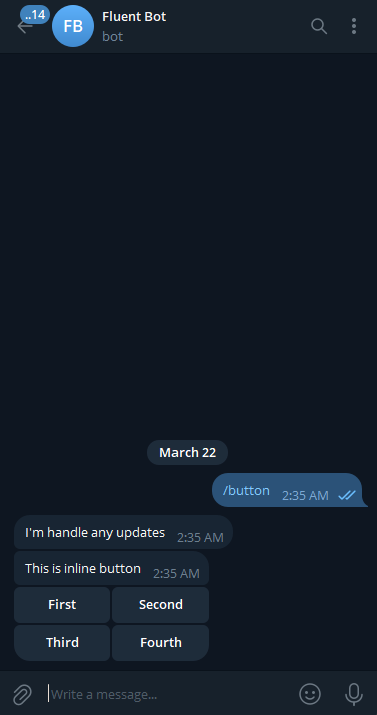

# Fluent - Easy Telegram Bots with Spring!

## Overview

This library provides a high-level abstraction for developing Telegram bots 🤖. The library simplifies the process of
receiving updates from Telegram and sending messages 📨. Additionally, you can easily integrate this library into your
project and customize it according to your preferences by using its latest version when developing your application 🚀.

## Prerequisites

* Fluent 1.2.0 requires at least Java 17, Spring Boot version 3.0.0 or above.

## Getting Started

### Maven

```xml
<dependency>
    <groupId>io.github.nurislom373</groupId>
    <artifactId>spring-boot-starter-fluent</artifactId>
    <version>1.2.0</version>
</dependency>
```

### Gradle

```groovy
implementation group: 'io.github.nurislom373', name: 'spring-boot-starter-fluent', version: '1.2.0'
```

## How to Use

After adding the dependency, set up your bot by adding the bot token and username in your application.yaml file.

```yaml
fluent:
  bot:
    token: <your bot token>
    username: <your bot username>
    process-type: update
```
Once you've added the token and username, create a bot controller.

```java
@UpdateController
public class FluentController {

    private final FluentTemplate fluentTemplate;

    public FluentController(FluentTemplate fluentTemplate) {
        this.fluentTemplate = fluentTemplate;
    }

    @HandleMessage("/start")
    public void fluent(Update update) {
        String text = update.getMessage().getText();
        fluentTemplate.sendText(text);
    }
}
```

Handling exceptions is easy too! Just create an exception controller.

```java
@ExceptionController
public class ExceptionHandler  {

    private final FluentTemplate fluentTemplate;

    public FluentController(FluentTemplate fluentTemplate) {
        this.fluentTemplate = fluentTemplate;
    }
    
    @HandleException({RuntimeException.class})
    void handleRuntimeExceptions(Update update, Throwable throwable) {
        fluentTemplate.sendText("I'm Handle Exception : " + throwable.getMessage());
    }

}
```

# Detailed documentation

## 1. Creating your bot

As written in the 'Getting Started' section of the tutorial, after adding the necessary dependency to our first program, 
you need to write the credentials related to the bot in a properties or YAML file. This alone is sufficient for now to 
start the bot and use it.

### Maven

```xml
<dependency>
    <groupId>io.github.nurislom373</groupId>
    <artifactId>spring-boot-starter-fluent</artifactId>
    <version>1.2.0</version>
</dependency>
```

### Gradle

```groovy
implementation group: 'io.github.nurislom373', name: 'spring-boot-starter-fluent', version: '1.2.0'
```

### Yaml configuration

```yaml
fluent:
  bot:
    token: <your bot token>
    username: <your bot username>
    process-type: update
```

## 2. Receiving updates

Let's see how we can receive requests that have come from Telegram in this section.

### 2.1 Controllers

We need to apply the `@UpdateController` annotation to classes that process requests coming from Telegram. This is necessary 
because when your application starts, the classes with the `@UpdateController` annotation are collected by the Fluent provider,
which then directs incoming requests to the methods of these classes.

```java
@UpdateController
public class FluentController {
    
    // ...
    
}
```

### 2.2 Handle message

Let's explore how we can write methods to process requests coming from Telegram in this section.

Let's start by discussing how to handle text messages that come through Telegram.
To handle text messages that come through Telegram, we use the @HandleMessage annotation. The @HandleMessage annotation 
allows us to implement various ways of handling text messages, such as using regex or expressions. It provides us with 
different paths to carry out the handling. Let's take a look at all of these.

```java
@HandleMessage("/start")
public void startExample() {
    fluentTemplate.sendText("Hello World!!!");
}
```

Tepada yozilgan kodda `@HandleMessage` annotatsiyasidan foydalanib telegramdan kelgan `/start` matnli xabarni ushlovchi method yozilgan.
Kelgan xabar `/start` bo'lsagina ushbu method ishga tushadi. Kelgan xabarni boshida yoki oxirida `/start` xabar bo'lsa unday bo'lmaydi.

Bunday bo'lishini yani kelgan matnli xabar to'liq `@HandleMessage` berilgan matnga mos bo'lsagina ishga tushishini sababi ko'rib chiqamiz.
`@HandleMessage` annotatsiyaini ichiga ko'rib ko'rishimiz mumkin.

```java
@ProcessUpdate
@Target({ElementType.METHOD})
@Retention(RetentionPolicy.RUNTIME)
public @interface HandleMessage {

    String value() default "/";

    MatchType match() default MatchType.EQUALS;
}
```

Tepadagi `@HandleMessage` annotatsiyasini kodida ko'zingiz tushgan bo'lishi mumkin `match()` methodiga default qiymati `EQUALS`
turibdi. Bundan chunishimiz mumkin default holatda ushbu annotatsiyaga berilgan xabar telegramdan kelgan matnli xabar bilan to'liq mos kelishini tekshiradi.
biz ushbu annotatsiyani match methodiga boshqa `MatchType` berish orqali kelgan xabarni tekshirish strategiyasini o'zgartirishimiz mumkin.
Misol uchun `message: ` bilan boshlangan istalgan matnli xabarni ulashni ko'ramiz. Buning uchun `@HandleMessage` annotatsiyasi qo'yilgan
methodni `MatchType` ni o'zgartirishimiz kerak. Pastdagi kodga ergashing:

```java
@HandleMessage(value = "message:", match = MatchType.STARTS_WITH)
public void startsWithExampleHandler() {
    fluentTemplate.sendText("I handle requests starts with 'message:'");
}
```

### 2.3 Handler method add update parameter

Ushbu bo'limda handler methodlarga update parameterni qo'shish ko'ramiz. Pastdagi kodga ergashing:

```java
@HandleMessage("/start")
public void startExample(Update update) {
    fluentTemplate.sendText("Hello World!!!");
}
```

Tepadagi kodda ko'rganingizdek handler methodlarga update parameter qo'shish imkoni bor. Telegramdan kelgan update ni
parameter sifatida kutsangiz, ushbu handler methodga update parameteri kiritilgan holatda chaqiriladi. Bu sizga update 
objectdan o'zingizga kerak qiymatlarni olish imkoni beradi.

Bundan tashqari `Update` parameter kutib olmasdan turib ham uni olishingiz mumkin. `FluentContextHolder` classini 
`getCurrentUpdate` methodidan foydalanib.

```java
@HandleAny(type = HandleType.MESSAGE, proceed = Proceed.NOT_PROCEED)
private void handleAnyMessages() {
    Update currentUpdate = FluentContextHolder.getCurrentUpdate();

    String text = currentUpdate.getMessage().getText();
    fluentTemplate.sendText(text);
}
```

### 2.4 MatchType

Ushbu bo'limda MatchType strategiyalarni ko'rib chiqamiz.

MatchType strategiyalari telegramdan kelgan xabarlarni tekshirish strategiyasini o'zgartirish uchun ishlatiladi.
Bu sizga murakkab conditionlarni yozish imkoni beradi.

* `STARTS_WITH`

START_WITH - match qilish strategiyasi telegramdan kelgan text xabarlarni match qilish uchun ishlatiladi. Belgilangan qiymatga
kelgan xabarni boshlanishi belgilangan qiymatga mos kelishiga tekshiradi. Yani kelgan xabar boshlanishi 'abs' bilan boshlanganligiga
tekshiradi agar mos kelsa ushbu handle ishga tushadi, aks bo'lsa yo'q :(

```java
@HandleMessage(value = "abs", match = MatchType.STARTS_WITH)
public void startsWithExampleHandler() {
    // ...
}
```

* `ENDS_WITH`

END_WITH - match strategiyasi ham `STARTS_WITH` ga o'xshab asosan text xabarlar match qilish uchun ishlatiladi. ENDS_WITH
strategiyasi STARTS_WITH ga o'xshash faqat ENDS_WITH xabarni boshlanishini emas oxirini belgilangan qiymatga mos kelishini
tekshiradi.

```java
@HandleMessage(value = "xyz", match = MatchType.ENDS_WITH)
public void endsWithExampleHandler() {
    // ...
}
```

* `CONTAINS`

CONTAINS - match strategiyasi ham asosan text xabarlar match qilish uchun ishlatiladi. CONTAINS strategiyasi belgilangan qiymatni
kelgan xabarni ichida bor yoki yoqligiga tekshiradi. Agar belgilangan qiymat telegramdan kelgan xabarni ichida mavjud bo'lsa
handler chaqiriladi.

```java
@HandleMessage(value = "hello", match = MatchType.CONTAINS)
public void endsWithExampleHandler() {
    // ...
}
```

* `EQUALS`

EQUALS - match strategiyasi default match strategiyasi hisoblanadi. EQUALS strategiyasi belgilangan qiymatga telegramdan kelgan
xabar mos kelgan taqdirdagina handler chaqiriladi.

```java
@HandleMessage(value = "/start", match = MatchType.EQUALS)
private void startExample(Update update) {
    // ...
}
```

* `REGEX`

REGEX - match strategiyasi belgilangan regex qiymatga telegramdan kelgan xabarni mos kelishini tekshiradi.
Pastdagi kodga e'tibor bering. Ushbu kodda file type `jpeg, png, pdf` bo'lsagina ushbu handler chaqiriladi.

```java
@HandleDocument(
        value = "([a-zA-Z0-9\\s_\\\\.\\-\\(\\):])+(.jpeg|.png|.pdf)$",
        match = MatchType.REGEX,
        property = DocumentScope.FILE_NAME
)
private void handleDocument() {
    // ...
}
```

* `EQUALS_IGNORE_CASE`

EQUALS_IGNORE_CASE - match strategiyasi `EQUALS` bilan bir xil faqat bitta farqi `EQUALS_IGNORE_CASE` harflarni katta yoki
kichikligiga qaramaydi.

```java
@HandleMessage(value = "/START", match = MatchType.EQUALS_IGNORE_CASE)
private void startExample(Update update) {
    // ...
}
```

* `EXPRESSION`

EXPRESSION - match strategiyasi sizga spel yani (Spring Expression Language) dan foydalanib expressionlarni yozish imkoni beradi va ushbu 
expressionga kelgan xabar mos kelsagina handler method chaqiriladi. Pastdagi kodga e'tibor bering. SPEL dan foydalanib
kelgan xabar boshlanishi 'a' harfdan boshlansa va tugashi esa 'z' harf bilan tugasa ushbu handler chaqiriladi.

'#value' - bu telegramdan kelgan xabar spelga o'zgaruvchi sifatida qo'shib qoyiladi. value o'zgaruvchisiga murojaat qilib o'zingizga
mos expressionni yozishingiz mumkin.

```java
@HandleMessage(value = "#value.startsWith('a') && #value.endsWith('z')", match = MatchType.EXPRESSION)
public void handleExpression() {
    // ...
}
```

* `VAR_EXPRESSION`

VAR_EXPRESSION - match strategiyasi ham text xabarlar bilan ishlash uchun ishlatiladi. VAR_EXPRESSION kelgan xabardan
regex patternga mos kelgan o'zgaruvchilarni ajratib olish uchun ishlatiladi. Pastdagi kodni ko'rishingiz mumkin.

```java
@HandleMessage(value = "/username : {name:[a-z]}", match = MatchType.VAR_EXPRESSION)
void startWithAbsHandler(Update update, @BotVariable("name") String username) {
    fluentTemplate.sendText("Username : " + username);
}
```

### 2.5 Handle any

`@HandleAny` annotatsiyasi telegramdan kelgan istalgan update handle qilish uchun ishlatiladi. `@HandleAny` boshqa handler
annotatsiyalaridan birinchi ishlaydi yani kelgan update birinchi `@HandleAny` annotatsiya bor method kiradi undan keyin
boshqa handler methodlarga birin ketin kirishni boshlaydi.

```java
@HandleAny(type = HandleType.MESSAGE)
private void handleAnyMessages() {
    String text = "I'm handle any updates";
    fluentTemplate.sendText(text);
}

@HandleMessage(value = "/button")
public void handleButtonCommand() {
    InlineKeyboardMarkupBuilder builder = new InlineKeyboardMarkupBuilder();

    builder.addButton("First")
            .callbackData("First");
    builder.addButton("Second")
            .callbackData("Second");

    builder.addRow();

    builder.addButton("Third")
            .callbackData("Third");
    builder.addButton("Fourth")
            .callbackData("Fourth");

    fluentTemplate.sendText("This is inline button", builder.build());
}
```



`@HandleAny` annotatsiyasi 2ta parameter qabul qiladi.

1. type - orqali biz qaysi typedagi updatelarni handle qilishni ko'rsatish uchun ishlatishimiz mumkin. default holatda biz
`@HandleAny` type ko'rsatmasak HandleType.MESSAGE ni oladi.

Quyidagi kodga qarang

```java
@HandleAny(type = HandleType.STICKER)
private void handleAnyStickers(Update update) {
    String value = objectMapper.writerWithDefaultPrettyPrinter().writeValueAsString(update.getMessage().getSticker());
    String text = "I'm handle this sticker : \n" + value;
    fluentTemplate.sendText(text);
}

@HandleAny(type = HandleType.PHOTO)
private void handleAnyPhoto(Update update) {
    String value = objectMapper.writerWithDefaultPrettyPrinter().writeValueAsString(update.getMessage().getPhoto());
    String text = "handle any this photo : \n" + value;
    fluentTemplate.sendText(text);
}

@HandleAny(type = HandleType.DOCUMENT)
private void handleAnyDocument(Update update) {
    String value = objectMapper.writerWithDefaultPrettyPrinter().writeValueAsString(update.getMessage().getDocument());
    String text = "I'm handle this document : \n" + value;
    fluentTemplate.sendText(text);
}

@HandleAny(type = HandleType.AUDIO)
private void handleAnyCallbacks(Update update) {
    String value = objectMapper.writerWithDefaultPrettyPrinter().writeValueAsString(update.getMessage().getAudio());
    String text = "I'm handle this audio : \n" + value;
    fluentTemplate.sendText(text);
}

@HandleAny(type = HandleType.VIDEO_NOTE)
private void handleAnyVideoNote(Update update) {
    String value = objectMapper.writerWithDefaultPrettyPrinter().writeValueAsString(update.getMessage().getVideoNote());
    String text = "I'm handle this video note : \n" + value;
    fluentTemplate.sendText(text);
}
```

bir vaqtni o'zida bir nechta typelarni qabul qilishimiz ham mumkin.

```java
@HandleAny(type = {HandleType.MESSAGE, HandleType.AUDIO})
private void handleAnyMessagesWithUpdate(Update update) {
    String text = "I'm handle message or audio updates";
    fluentTemplate.sendText(text);
}
```

2. proceed - orqali biz `@HandleAny` annotatsiyasi qoyilgan method bajarilgandan so'ng undan keyingi handler methodlar
bajarilishi yoki bajarilmasligini belgilashimiz mumkin. Agar Proceed.PROCEED turgan bo'lsa o'zidan keyingi
method bajarilishiga ruhsat beradi. Agar aksi bo'lsa unda o'zidan keyingi handler methodlarni bajarilishiga ruhsat
bermaydi. Qiymat belgilanmagan holda `@HandleAny` type parameteri _HandleType.MESSAGE_ ni, proceed parameteri esa
_Proceed.PROCEED_ oladi.

Quyidagi misolga qarang

Ushbu misolda `@HandleAny` annotatsiyasini proceed parameteri default holatda turibdi. Yani `Proceed.PROCEED`

```java
@UpdateController
public class SimpleController {

    @HandleAny
    void handleAnyMessage(Update update) {
        fluentTemplate.sendText("Handler Any Message😎");
    }

    @HandleMessage(value = "abs", scope = MatchScope.START_WITH)
    void startWithAbsHandler(Update update) {
        String text = "Start With 'abs' : " + update.getMessage().getText();
        fluentTemplate.sendText(text);
    }
}
```


`@HandleAny` annotatsiyani proceed type `NOT_PROCEED` ga o'zgartiramiz va natijasini ko'ramiz.

```java
@UpdateController
public class SimpleController {

    @HandleAny(proceed = Proceed.NOT_PROCEED)
    void handleAnyMessage(Update update) {
        fluentTemplate.sendText("Handler Any Message😎");
    }

    @HandleMessage(value = "abs", scope = MatchScope.START_WITH)
    void startWithAbsHandler(Update update, AbsSender sender) {
        String text = "Start With 'abs' : " + update.getMessage().getText();
        fluentTemplate.sendText(text);
    }
}
```


rasmdagi natijani ko’rgan bo’lsangiz faqat `@HandleAny` method ishladi va undan keyin handlar method bajarilmadi.

`@HandleAny` annotatsiyasi qoyilgan methodni hech qanday parameterlarsiz ham yozishimiz mumkin. 

```java
@HandleAny
public void handleAnyMessage() {
    fluentTemplate.sendText("Handler Any Message😎");
}
```

## 3. FluentTemplate

Fluent xabar yuborish uchun asosiy rol o'ynaydigan "template" ni taqdim etadi. Xabar yuborish uchun asosiy operatsiyalarni
belgilaydigan interface `FluentTemplate` deb ataladi. Ushbu operatsiyalar sizga xabar yuborishni ancha osonlash tiradi.
Xabar yuborish uchun siz endi object yaratishingizni va chat_id ni o'rnatishingizni hojati yoq siz uchun bu ishni FluentTemplate
bajarib beradi.

FluentTemplate o'z ichiga qamrab olgan asosiy operatsiyalar

- text, audio, document, photo, video va boshqalarni yuborish uchun operatsiyalar
- callback va inline query larga javob yuborish uchun operatsiyalar
- xabarlarni yangilash o'chirish, o'zgarishtirish va boshqalar uchun operatsiyalar

Quyidagi kodga e'tibor bering

- Xabar yuborishga misol

```java
private void sendTextExample() {
    fluentTemplate.sendText("'Hello World' message send!");
}
```

Tepadagi kodda e'tibor bergan bo'lsangiz xabar yuborish uchun hech qanday yangi object va chat_id ni o'rnatish shart bo'lmagan
shunchaki yubormoqchi bo'lgan xabaringizni o'zini kiritish yetarli. Ushbu xabar current update ni chat_id ga jo'natiladi.
Agar siz boshqa chat_id jo'natmoqchi bo'lsangiz uni ham qilishingiz mumkin.

```java
private void sendTextExample() {
    fluentTemplate.sendText("'Hello World' message send!", 574635734L);
}
```

- Xabarni reply keyboard bilan birga yuborishga misol

```java
public void sendTextWithReplyKeyboardExample() {
    ReplyKeyboardMarkupBuilder builder = new ReplyKeyboardMarkupBuilder();
    builder.oneTimeKeyboard(true);

    builder.addButton("First");
    builder.addButton("Second");

    builder.addRow();

    builder.addButton("Third");
    builder.addButton("Fourth");

    fluentTemplate.sendText("This is reply button", builder.build());
}
```

- Audio yuborishga misol

```java
public void sendAudioExample() {
    InputStream inputStream = getClass().getResourceAsStream("/fluent.m4a");
    fluentTemplate.sendAudio(inputStream, "fluent.m4a");
}
```

- Boshqa operatsiyalarni ushbu kerakli classlarga kirib ko'rishingiz mumkin.

  - [SendTextOperations.java](fluent-core%2Fsrc%2Fmain%2Fjava%2Forg%2Fkhasanof%2Fservice%2Ftemplate%2Foperations%2FSendTextOperations.java)
  - [SendAudioOperations.java](fluent-core%2Fsrc%2Fmain%2Fjava%2Forg%2Fkhasanof%2Fservice%2Ftemplate%2Foperations%2FSendAudioOperations.java)
  - [SendAnimationOperations.java](fluent-core%2Fsrc%2Fmain%2Fjava%2Forg%2Fkhasanof%2Fservice%2Ftemplate%2Foperations%2FSendAnimationOperations.java)
  - [SendChatActionOperations.java](fluent-core%2Fsrc%2Fmain%2Fjava%2Forg%2Fkhasanof%2Fservice%2Ftemplate%2Foperations%2FSendChatActionOperations.java)
  - [SendContactOperations.java](fluent-core%2Fsrc%2Fmain%2Fjava%2Forg%2Fkhasanof%2Fservice%2Ftemplate%2Foperations%2FSendContactOperations.java)
  - [SendDiceOperations.java](fluent-core%2Fsrc%2Fmain%2Fjava%2Forg%2Fkhasanof%2Fservice%2Ftemplate%2Foperations%2FSendDiceOperations.java)
  - [SendDocumentOperations.java](fluent-core%2Fsrc%2Fmain%2Fjava%2Forg%2Fkhasanof%2Fservice%2Ftemplate%2Foperations%2FSendDocumentOperations.java)
  - [SendGameOperations.java](fluent-core%2Fsrc%2Fmain%2Fjava%2Forg%2Fkhasanof%2Fservice%2Ftemplate%2Foperations%2FSendGameOperations.java)
  - [SendLocationOperations.java](fluent-core%2Fsrc%2Fmain%2Fjava%2Forg%2Fkhasanof%2Fservice%2Ftemplate%2Foperations%2FSendLocationOperations.java)
  - [SendMediaGroupOperations.java](fluent-core%2Fsrc%2Fmain%2Fjava%2Forg%2Fkhasanof%2Fservice%2Ftemplate%2Foperations%2FSendMediaGroupOperations.java)
  - [SendPhotoOperations.java](fluent-core%2Fsrc%2Fmain%2Fjava%2Forg%2Fkhasanof%2Fservice%2Ftemplate%2Foperations%2FSendPhotoOperations.java)
  - [SendStickerOperations.java](fluent-core%2Fsrc%2Fmain%2Fjava%2Forg%2Fkhasanof%2Fservice%2Ftemplate%2Foperations%2FSendStickerOperations.java)
  - [SendVideoNoteOperations.java](fluent-core%2Fsrc%2Fmain%2Fjava%2Forg%2Fkhasanof%2Fservice%2Ftemplate%2Foperations%2FSendVideoNoteOperations.java)
  - [SendVideoOperations.java](fluent-core%2Fsrc%2Fmain%2Fjava%2Forg%2Fkhasanof%2Fservice%2Ftemplate%2Foperations%2FSendVideoOperations.java)
  - [SendVoiceOperations.java](fluent-core%2Fsrc%2Fmain%2Fjava%2Forg%2Fkhasanof%2Fservice%2Ftemplate%2Foperations%2FSendVoiceOperations.java)
  - [ForwardMessageOperations.java](fluent-core%2Fsrc%2Fmain%2Fjava%2Forg%2Fkhasanof%2Fservice%2Ftemplate%2Foperations%2FForwardMessageOperations.java)
  - [DeleteMessageOperations.java](fluent-core%2Fsrc%2Fmain%2Fjava%2Forg%2Fkhasanof%2Fservice%2Ftemplate%2Foperations%2Fupdatingmessages%2FDeleteMessageOperations.java)
  - [EditMessageCaptionOperations.java](fluent-core%2Fsrc%2Fmain%2Fjava%2Forg%2Fkhasanof%2Fservice%2Ftemplate%2Foperations%2Fupdatingmessages%2FEditMessageCaptionOperations.java)
  - [EditMessageLiveLocationOperations.java](fluent-core%2Fsrc%2Fmain%2Fjava%2Forg%2Fkhasanof%2Fservice%2Ftemplate%2Foperations%2Fupdatingmessages%2FEditMessageLiveLocationOperations.java)
  - [EditMessageMediaOperations.java](fluent-core%2Fsrc%2Fmain%2Fjava%2Forg%2Fkhasanof%2Fservice%2Ftemplate%2Foperations%2Fupdatingmessages%2FEditMessageMediaOperations.java)
  - [EditMessageReplyMarkupOperations.java](fluent-core%2Fsrc%2Fmain%2Fjava%2Forg%2Fkhasanof%2Fservice%2Ftemplate%2Foperations%2Fupdatingmessages%2FEditMessageReplyMarkupOperations.java)
  - [EditMessageTextOperations.java](fluent-core%2Fsrc%2Fmain%2Fjava%2Forg%2Fkhasanof%2Fservice%2Ftemplate%2Foperations%2Fupdatingmessages%2FEditMessageTextOperations.java)
  - [AnswerCallbackQueryOperations.java](fluent-core%2Fsrc%2Fmain%2Fjava%2Forg%2Fkhasanof%2Fservice%2Ftemplate%2Foperations%2Fquery%2FAnswerCallbackQueryOperations.java)
  - [AnswerInlineQueryOperations.java](fluent-core%2Fsrc%2Fmain%2Fjava%2Forg%2Fkhasanof%2Fservice%2Ftemplate%2Foperations%2Fquery%2FAnswerInlineQueryOperations.java)

## 4. Handling exceptions

Fluent kutubxonasi xatolar bilan ham ishlash uchun kuchli funksionalikni taqdim etadi. Bu funksionalikdan foydalanib dastur 
ishlash vaqtida yuzagan kelishi mumkin bo'lgan xatolarni osonlik bilan ushlab uni qayta ishlashimiz mumkin.

Quyidagi kodga qarang:
```java
@ExceptionController
public class SimpleExceptionHandler {

    @HandleException({RuntimeException.class})
    public void handleRuntimeException(RuntimeException exception) {
        // write your logic...
    }
}
```

`@ExceptionController` annotatsiyasi xatolarni qayta ishlovchi class sifatida belgilash uchun qo'yishingiz kerak!.
ushbu annotatsiyani classni ustiga qo'yganingizdan so'ng. Ushbu class ichida xatolarni qayta ishlovchi methodlarni
yozishingiz mumkin. 

Xatolarni qayta ishlovchi method yozish qoidalari.

1. Xatolarni qayta ishlovchi method yozishingiz uchun siz qilishingiz shart bo'lgan ish method ustiga `@HandleException`
annotatsiyasini qo'yish va annotatsiyada qaysi `Exception`larni handle qilishini ko'rsatishdir.
2. Methodni hech qanday parametersiz ham yozishingiz ham mumkin. Xatolarni qayta ishlovchi methodlarga 2ta parameter kirib 
kelishi mumkin birinchisi `Exception`, ikkinchisi esa `Update` bu ikklasini istalgani kutib olishingiz hamda ikkalasini ham 
kutib olishingiz mumkin. Birinchi `Exception` keyin `Update` kirishi ham majuburiy emas qaysi biri birinchi kirishi ahamiyatsiz asosiysi
shu 2ta parameterlarni to'g'ir belgilashingiz.

## 5. Making keyboards

Fluent kutubxonasi keyboardlarni yasash uchun ham API larni taqdim etadi. Ushbu API lar keyboardlarni yasashi ancha osonlashtiradi.

Fluent API dan foydalanmasdan keyboardlarni yaratish uchun yozilgan kod:

```java
public InlineKeyboardMarkup inlineKeyboardMarkup() {
    InlineKeyboardMarkup inlineKeyboardMarkup = new InlineKeyboardMarkup();

    InlineKeyboardButton next = new InlineKeyboardButton("NEXT");
    next.setCallbackData("NEXT");

    InlineKeyboardButton prev = new InlineKeyboardButton("PREV");
    prev.setCallbackData("PREV");

    InlineKeyboardButton top = new InlineKeyboardButton("TOP");
    top.setCallbackData("TOP");

    InlineKeyboardButton bottom = new InlineKeyboardButton("BOTTOM");
    bottom.setCallbackData("BOTTOM");

    List<InlineKeyboardButton> row1 = new ArrayList<>();
    row1.add(next);
    row1.add(prev);

    List<InlineKeyboardButton> row2 = new ArrayList<>();
    row2.add(top);
    row2.add(bottom);

    inlineKeyboardMarkup.setKeyboard(Arrays.asList(row1, row2));
    return inlineKeyboardMarkup;
}
```

Fluent API dan foydalanib keyboardlarni yaratish uchun yozilgan kod:
```java
public InlineKeyboardMarkup inlineKeyboardMarkup() {
    InlineKeyboardMarkupBuilder builder = new InlineKeyboardMarkupBuilder();

    builder.addButton("NEXT")
            .callbackData("NEXT");
    
    builder.addButton("PREV")
            .callbackData("PREV");

    builder.addRow();

    builder.addButton("TOP")
            .callbackData("TOP");
    
    builder.addButton("BOTTOM")
            .callbackData("BOTTOM");

    InlineKeyboardMarkup inlineKeyboardMarkup = builder.build();
}
```

Tepadagi ko'rsatilgan kodlar ikkalasi ham bir xil keyboardlarni yaratish uchun yozilgan kodlar.

Result:


### 5.1 Inline keyboard

Inline keyboardlarni yasash uchun ishlashtiladigan class `InlineKeyboardMarkupBuilder`.
Ushbu classdan foydalanib siz inline keyboardlarni osonlik bilan yasashingiz mumkin.

Quyidagi kodga qarang:

```java
public InlineKeyboardMarkup inlineKeyboardMarkupExample() {
    InlineKeyboardMarkupBuilder builder = new InlineKeyboardMarkupBuilder();

    builder.addButton("Next")
            .callbackData("Next");

    InlineKeyboardMarkup inlineKeyboardMarkup = builder.build();
}
```

Natijasi:


`addRow` method foydalanib osongina yangi row qo'shingiz mumkin.

```java
builder.addRow();
```

```java
public InlineKeyboardMarkup inlineKeyboardMarkupExample() {
    InlineKeyboardMarkupBuilder builder = new InlineKeyboardMarkupBuilder();

    builder.addButton("Next")
            .callbackData("Next");

    builder.addRow();
    
    builder.addButton("Prev")
          .callbackData("Prev");

    InlineKeyboardMarkup inlineKeyboardMarkup = builder.build();
}
```

Tepadagi kodni natijasi:


### 5.2 Reply keyboard

Reply keyboardlarni yasash uchun ishlatiladigan class `ReplyKeyboardMarkupBuilder`.
Ushbu classdan foydalanib siz reply keyboardlarni osonlik bilan yasashingiz mumkin huddi inline keyboardga o'xshab.

Quyidagi kodga qarang:

```java
public void handleReplyCommand() {
    ReplyKeyboardMarkupBuilder builder = new ReplyKeyboardMarkupBuilder();
    builder.oneTimeKeyboard(true);

    builder.addButton("First");
    builder.addButton("Second");

    builder.addRow();

    builder.addButton("Third");
    builder.addButton("Fourth");

    ReplyKeyboardMarkup replyKeyboardMarkup = builder.build();
}
```

Natijasi:


## 6. Interceptors

Fluent kutubxonasi sizga Interceptorlarni qo'shish imkonini beradi. Interceptor nima ekanligini bilmaydiganlarga
uchun istalgan action chaqiruvchidan oldin va keyin framework tomonidan chaqiriladigan funksiya yani method.
Spring Interceptorlari httpdan kirib request kelganda va chiqib ketayotgan chiqariladi. Fluent tomonidan taqdim etiladigan
interceptorlar ham huddi shunday faqat telegramdan kirib kelgan requestlar uchun ishlaydi.

Quyidagi kodga qarang:

```java
@Slf4j
public class SimpleFluentInterceptor implements FluentInterceptor {

    @Override
    public boolean preHandle(Update update) {
        log.info("FluentInterceptor handle update! : {}", update.getUpdateId());
        return FluentInterceptor.super.preHandle(update);
    }

    @Override
    public void postHandle(Update update) {
        log.warn("FluentInterceptor handle update end!");
    }
}
```
```java
@Configuration
public class FluentInterceptorConfig {

    private final FluentInterceptorRegistryContainer registryContainer;

    public FluentInterceptorConfig(FluentInterceptorRegistryContainer registryContainer) {
        this.registryContainer = registryContainer;
    }

    @PostConstruct
    public void registerFluentInterceptor() {
        registryContainer.addFluentInterceptor(new SimpleFluentInterceptor());
    }
}
```

Natijasi:


Birinchi `SimpleFluentInterceptor` classi bu interceptor. Fluentda interceptor yozishingiz uchun `FluentInterceptor`
interfacedan implementatsiya olishingiz va uni ichida kerakli logikangizni yozishingiz mumkin bo'ladi.

Ikkinchi `FluentInterceptorConfig` classi esa oldin yozilgan `SimpleFluentInterceptor` ni ro'yxatdan o'tkazish uchun
yozildi boshqacha qilib aytganda yozgan interceptorimizni Fluent kutubxonasi tanib olishi uchun uni ro'yxatdan o'tkazishimiz
kerak bo'ladi. `FluentInterceptorRegistryContainer` classini siz interceptorlarni ro'yxatdan o'tkazish uchun ishlatasiz.

## 7. State
## 8. Conditions
## 9. Configure Postgresql
## 10. Inline Query
## 11. Customization

# Contributors

<table>
    <tbody>
        <tr>
            <td align="center" valign="top" width="14.28%"><a href="https://github.com/Nurislom373"><br /><sub><b>Nurislom Xasanov</b></sub></a><br /><a href="#" title="Code">💻</a></td>
        </tr>
        <tr>
            <td align="center" valign="top" width="14.28%"><a href="https://github.com/Nurislom373"><br /><sub><b>Shukrullaev Abdulloh</b></sub></a><br /><a href="#" title="Code">💻</a></td>
        </tr>
        <tr>
            <td align="center" valign="top" width="14.28%"><a href="https://github.com/Nurislom373"><br /><sub><b>Rahimova Shoxista</b></sub></a><br /><a href="#" title="Code">💻</a></td>
        </tr>
        <tr>
            <td align="center" valign="top" width="14.28%"><a href="https://github.com/Nurislom373"><br /><sub><b>Elmurodov Javohir</b></sub></a><br /><a href="#" title="Code">🌍💻</a></td>
        </tr>
    </tbody>
</table>

## License

[MIT License](https://github.com/Nurislom373/Fluent-Doc/blob/main/LICENSE)

© 2023 Nurislom

You have permission to use this software for free. For more details, check the [full license](https://github.com/Nurislom373/Fluent-Doc/blob/main/LICENSE).